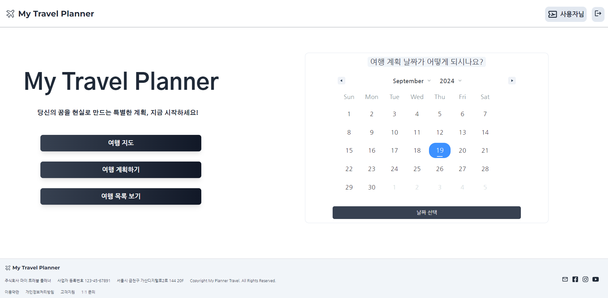
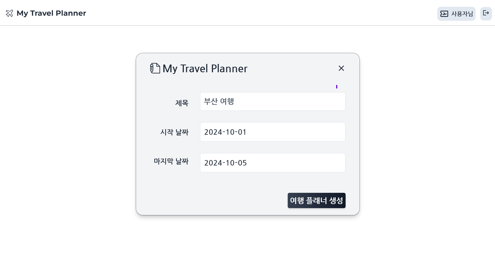

# CRM 서비스 프로젝트 / My Planner

<p align="center">
  
</p>

<P align="justify">
  배포 URL: https://myplanner.guswldaiccproject.com

  
  TestID : Test@gmail.com


  TESTPW : 12345


</p>

# 1. 프로젝트 소개 및 개발 목적


### 프로젝트 소개
  
  *  AI를 통해 여행 계획을 작성하는 웹은 있습니다. 하지만 사용자가 직접 여행 날짜, 장소, 메모 등 하는 웹은 없습니다.


  * 여행을 좋아하는 사용자가 자신만의 여행 일지를 커스타마이징 하는 스케쥴링 시스템.


### 프로젝트 개발 목적

  * 체계적인 여행계획을 세울 수 있는 todo 리스트 


  * 여행 계획 뿐만 아니라 사용자가 방문했던 장소를 사진을 등록하고 메모할 수 있는 시스템


  1. 구글 지도 제공하여 로드맵 확인 가능


  2. 일정버튼을 클릭하면 캘린더에서 날짜를 선택


  3. 날짜에 따라서 좌측에 나열된 장소를 클릭하면 우측에 내가 적었던 메모리스트가 나올 수 있고, 추가도 가능


# 2. 개발 환경

* Installing / 설치

아래 사항들로 현 프로젝트에 관한 모듈들을 설치할 수 있습니다.

```
* NPM 모듈 사용 (Package)

* EXPRESS, CORS, DOTENV, NODEMON, PG

* Postgresql (AWS - RDS)
```

```
* Back : node.js

📦 My Planner Back
├── 📂 controllers
│   ├── updateData.js
│   ├── deleteData.js
│   ├── getData.js
│   ├── postData.js
│   └── postUser.js
│
├── 📂 database
│   ├── database.js
│   └── db.sql
│
├── 📂 routes
│   ├── updateRoute.js
│   ├── deleteRoute.js
│   ├── getRoute.js
│   └── postRoute.js
│
├── 📂 uploads
│   └── (업로드된 파일들)
│
├── 📂 node_modules
│   └── (의존성 모듈들)
│
├── index.js
├── package-lock.json
├── package.json
└── README.md


* DB : Postgresql 사용

* Mariadb, MySQL 가능

📦 users
├── user_idx: SERIAL PRIMARY KEY      -- 자동 증가하는 기본 키
├── name: VARCHAR(100) NOT NULL      -- 사용자 이름
├── email: VARCHAR(100) UNIQUE NOT NULL  -- 사용자 이메일 
└── password: VARCHAR(100) NOT NULL  -- 사용자 비밀번호

📦 travel_project
├── project_idx: SERIAL PRIMARY KEY   -- 자동 증가하는 기본 키
├── user_idx: INT                     -- 사용자 테이블과 조인 컬럼 
├── project_title: VARCHAR(255)       -- 프로젝트 제목
├── project_date: TIMESTAMP NOT NULL DEFAULT CURRENT_TIMESTAMP  -- 프로젝트 생성일
├── start_date: DATE NOT NULL         -- 프로젝트 시작일
├── end_date: DATE NOT NULL           -- 프로젝트 종료일
├── update_date: TIMESTAMP NOT NULL DEFAULT CURRENT_TIMESTAMP  -- 프로젝트 업데이트 날짜
├── planner_title: VARCHAR(255)       -- 플래너 제목
├── planner_description: TEXT         -- 플래너 설명
├── planner_date: DATE                -- 플래너 생성일
├── planner_update_date: TIMESTAMP NOT NULL DEFAULT CURRENT_TIMESTAMP  -- 플래너 업데이트 날짜
└── planner_img: TEXT                 -- 플래너 이미지 URL 또는 경로
```

## 3.  구현 기능

### 캘린더 기능

<p align="center">
  
</p>

### 날짜 선택

<p align="center">
  
</p>

```
POST /post_calendar
Content-Type: application/json

{
  "user_idx": 1,
  "startDate": "2024-10-01",
  "endDate": "2024-10-07"
}

```

<p align="center">
  
</p>

```
GET /get_calendar_data/:user_idx

[
  {
    "project_idx": 1,
    "start_date": "2024-09-01",
    "end_date": "2024-09-10"
  }
]

```

```
GET /get_travel_data/:user_idx

{
"project_idx": 73,
"project_title": "경주 여행",
"start_date": "2023-12-12T00:00:00.000Z",
"end_date": "2023-12-14T00:00:00.000Z",
"planner_title": "불국사와 첨성대 방문",
"planner_description": "가족과 함께 경주로 역사 여행을 다녀왔어요 ~",
"planner_date": "2024-08-15T00:00:00.000Z",
"planner_img": "http://plannerback.guswldaiccproject.com/uploads/1726711358045.jpg"
}

```

### 테스트는 이런 식으로 동작합니다

왜 이렇게 동작하는지, 설명합니다

```
예시
```

### 테스트는 이런 식으로 작성하시면 됩니다

```
예시
```

## Deployment / 배포

Add additional notes about how to deploy this on a live system / 라이브 시스템을 배포하는 방법

## Built With / 누구랑 만들었나요?

* [이름](링크) - 무엇 무엇을 했어요
* [Name](Link) - Create README.md

## Contributiong / 기여

Please read [CONTRIBUTING.md](https://gist.github.com/PurpleBooth/b24679402957c63ec426) for details on our code of conduct, and the process for submitting pull requests to us. / [CONTRIBUTING.md](https://gist.github.com/PurpleBooth/b24679402957c63ec426) 를 읽고 이에 맞추어 pull request 를 해주세요.

## License / 라이센스

This project is licensed under the MIT License - see the [LICENSE.md](https://gist.github.com/PurpleBooth/LICENSE.md) file for details / 이 프로젝트는 MIT 라이센스로 라이센스가 부여되어 있습니다. 자세한 내용은 LICENSE.md 파일을 참고하세요.

## Acknowledgments / 감사의 말

* Hat tip to anyone whose code was used / 코드를 사용한 모든 사용자들에게 팁
* Inspiration / 영감
* etc / 기타

<!-- Stack Icon Refernces -->

[react]: /uploads/react.png
[node]: /uploads/nodejs.png
[pg]: /uploads/pg.png
