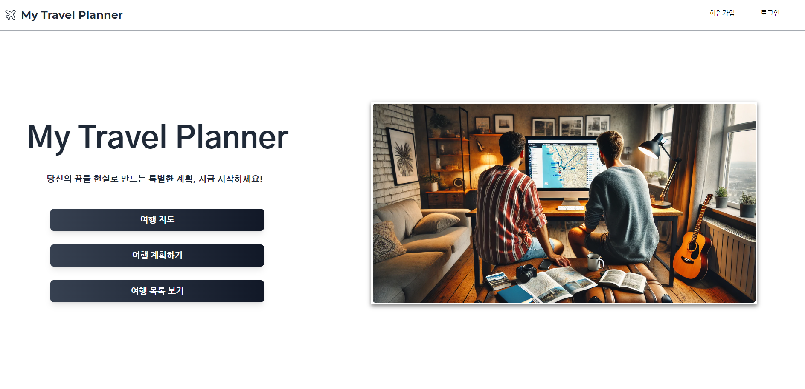

# CRM 서비스 프로젝트

## My Planner
<p align="center">
  <br>
  
  <br>
</p>
<p align="justify">
  <br>
  배포 URL: https://myplanner.guswldaiccproject.com
  <br>
  TestID : Test@gmail.com
  <br>
  TESTPW : 12345
  <br>
</p>


## Getting Started / 프로젝트 소개 및 개발 목적
<p align="justify">
  <br>
  *  AI를 통해 여행 계획을 작성하는 웹은 있습니다. 하지만 사용자가 직접 여행 날짜, 장소, 메모 등 하는 웹은 없습니다.
  <br>
  * 여행을 좋아하는 사용자가 자신만의 여행 일지를 커스타마이징 하는 여행 스케쥴링 시스템.
</p>
<p align="justify">
  <br>
  * 체계적인 여행계획을 세울 수 있는 todo 리스트 
  <br>
  * 여행 계획 뿐만 아니라 사용자가 방문했던 장소를 사진을 등록하고 메모할 수 있는 시스템
  <br>
  <br>
  1. 지도를 통해 여행 계획 참고
  <br>
  2. 일정버튼을 클릭하면 캘린더에서 날짜를 선택
  <br>
  3. 날짜에 따라서 좌측에 나열된 장소를 클릭하면 우측에 내가 적었던 메모리스트가 나올 수 있고, 추가도 가능
  <br>
</p>

### Prerequisites / 선행 조건

아래 사항들이 설치가 되어있어야합니다.

```
예시
```

### Installing / 설치

아래 사항들로 현 프로젝트에 관한 모듈들을 설치할 수 있습니다.

```
예시
```

## Running the tests / 테스트의 실행

어떻게 테스트가 이 시스템에서 돌아가는지에 대한 설명을 합니다

### 테스트는 이런 식으로 동작합니다

왜 이렇게 동작하는지, 설명합니다

```
예시
```

### 테스트는 이런 식으로 작성하시면 됩니다

```
예시
```

## Deployment / 배포

Add additional notes about how to deploy this on a live system / 라이브 시스템을 배포하는 방법

## Built With / 누구랑 만들었나요?

* [이름](링크) - 무엇 무엇을 했어요
* [Name](Link) - Create README.md

## Contributiong / 기여

Please read [CONTRIBUTING.md](https://gist.github.com/PurpleBooth/b24679402957c63ec426) for details on our code of conduct, and the process for submitting pull requests to us. / [CONTRIBUTING.md](https://gist.github.com/PurpleBooth/b24679402957c63ec426) 를 읽고 이에 맞추어 pull request 를 해주세요.

## License / 라이센스

This project is licensed under the MIT License - see the [LICENSE.md](https://gist.github.com/PurpleBooth/LICENSE.md) file for details / 이 프로젝트는 MIT 라이센스로 라이센스가 부여되어 있습니다. 자세한 내용은 LICENSE.md 파일을 참고하세요.

## Acknowledgments / 감사의 말

* Hat tip to anyone whose code was used / 코드를 사용한 모든 사용자들에게 팁
* Inspiration / 영감
* etc / 기타

<!-- Stack Icon Refernces -->

[react]: /uploads/react.png
[node]: /uploads/nodejs.png
[pg]: /uploads/pg.png
