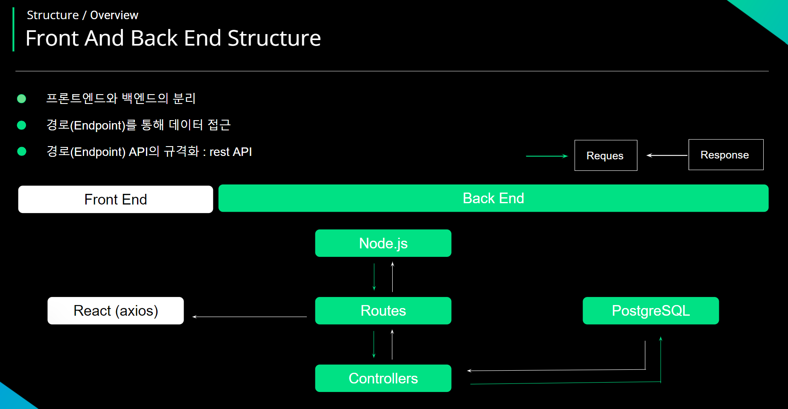

# CRM Service Project 

* My Travel Planner

<p align="center">
  
</p>

<P align="justify">
  배포 URL: https://myplanner.guswldaiccproject.com

  
  Test_ID : Test@gmail.com


  TEST_PW : 12345


</p>

# 1. 프로젝트 소개 & 목적


### 프로젝트 소개
  
  *  AI를 통해 여행 계획을 작성하는 웹은 있습니다.
  
  
  *  사용자가 달력으로 여행 날짜, 장소, 정보 작성 하는 웹은 없습니다.
  

  * 여행 계획 뿐만 아니라 사용자가 방문했던 장소를 사진을 등록하고 여행 정보를 작성 할 수 있는 시스템


### 프로젝트 목적

  * 구글 지도 제공하여 로드맵 확인 가능


  * 일정 계획을 통해 캘린더에서 날짜를 선택하여 목록 생성


  * 여행 장소를 시 우측에 내가 적었던 여행 정보 표현, 수정 및 삭제 가능


# 2. 개발 환경

* 기술 스택

```
* BACK & DB

Package - node.js

* EXPRESS, CORS, DOTENV, NODEMON, PG

* Back : node.js

📦 My Planner Back
├── 📂 controllers
│   ├── updateData.js
│   ├── deleteData.js
│   ├── getData.js
│   ├── postData.js
│   └── postUser.js
│
├── 📂 database
│   ├── database.js
│   └── db.sql
│
├── 📂 routes
│   ├── updateRoute.js
│   ├── deleteRoute.js
│   ├── getRoute.js
│   └── postRoute.js
│
├── 📂 uploads
│   └── (업로드된 파일들)
│
├── 📂 node_modules
│   └── (의존성 모듈들)
│
├── index.js
├── package-lock.json
├── package.json
└── README.md

* DB : Postgresql 

📦 users
├── user_idx: SERIAL PRIMARY KEY      -- 자동 증가하는 기본 키
├── name: VARCHAR(100) NOT NULL      -- 사용자 이름
├── email: VARCHAR(100) UNIQUE NOT NULL  -- 사용자 이메일 
└── password: VARCHAR(100) NOT NULL  -- 사용자 비밀번호

📦 travel_project
├── project_idx: SERIAL PRIMARY KEY   -- 자동 증가하는 기본 키
├── user_idx: INT                     -- 사용자 테이블과 조인 컬럼 
├── project_title: VARCHAR(255)       -- 프로젝트 제목
├── project_date: TIMESTAMP NOT NULL DEFAULT CURRENT_TIMESTAMP  -- 프로젝트 생성일
├── start_date: DATE NOT NULL         -- 프로젝트 시작일
├── end_date: DATE NOT NULL           -- 프로젝트 종료일
├── update_date: TIMESTAMP NOT NULL DEFAULT CURRENT_TIMESTAMP  -- 프로젝트 업데이트 날짜
├── planner_title: VARCHAR(255)       -- 플래너 제목
├── planner_description: TEXT         -- 플래너 설명
├── planner_date: DATE                -- 플래너 생성일
├── planner_update_date: TIMESTAMP NOT NULL DEFAULT CURRENT_TIMESTAMP  -- 플래너 업데이트 날짜
└── planner_img: TEXT                 -- 플래너 이미지 URL 또는 경로
```

# 3.  구현 기능

### 캘린더 기능

<p align="center">
  
</p>

### 날짜 선택

<p align="center">
  
</p>

```
POST /post_calendar
Content-Type: application/json

{
  "user_idx": 1,
  "startDate": "2024-10-01",
  "endDate": "2024-10-07"
}

```

* POST - BODY ( user의 id와 여행 시작 날짜, 끝 날짜 )
* front (react) => back (node.js) => DB (postgresql)에 저장

<p align="center">
  
</p>

```
GET /get_calendar_data/:user_idx

[
  {
    "project_idx": 1,
    "start_date": "2024-09-01",
    "end_date": "2024-09-10"
  }
]

```

* GET -  생성된 여행 프로젝트 ID, 여행 시작 날짜, 끝 날짜 데이터
* DB (postgresql) <=> BACK (Node.js) => FRONT (React) GET 요청

```
PATCH /update_planner_title

{
"project_title" : "부산 여행",
"project_idx" : 1 
}

```

* PATCH -  생성된 여행 프로젝트 ID, 여행 Title update
* front (react) <=> back (node.js) => DB (postgresql) UPDATE 요청

```
GET /get_travel_data/:user_idx

{
"project_idx": 73,
"project_title": "경주 여행",
"start_date": "2023-12-12T00:00:00.000Z",
"end_date": "2023-12-14T00:00:00.000Z",
"planner_title": "불국사와 첨성대 방문",
"planner_description": "가족과 함께 경주로 역사 여행을 다녀왔어요 ~",
"planner_date": "2024-08-15T00:00:00.000Z",
"planner_img": "http://plannerback.guswldaiccproject.com/uploads/1726711358045.jpg"
}

```

* GET -  생성된 여행 프로젝트 ID, 여행 TITLE, 여행 시작 날짜, 끝 날짜, 여행 플래너 title, 내용, 작성 날짜, 이미지 데이터터
* DB (postgresql) <=> BACK (Node.js) => FRONT (React) GET 요청

# 4. 배포

### Front & Back Flow

<p align="center">
  
</p>

### Back (Node.js)

```
📦 Back - Node.js Deploy
├── 📂 aws
│   ├── ec2
│   │   ├── nginx.conf
│   │   ├── pm2
│   │   └── actions-runner
│   ├── 인증서
│   │   └── SSL 인증서 (https)
│   ├── route53
│   │   └── 도메인 설정 파일 (origin)
│   └── cloudfront
│       └── CDN 설정 파일
│
├── 📂 github
│   ├── runner
│   │   └── self-hosted-runner 설정
│   ├── env
│   │   └── 환경 변수 (database, login secret key 등)
│   └── node.js
│       └── config.js (Node.js 관련 환경 설정 파일)
│
└── README.md

```

# 5. 트러블 슈팅

# 6. 개발 후기
